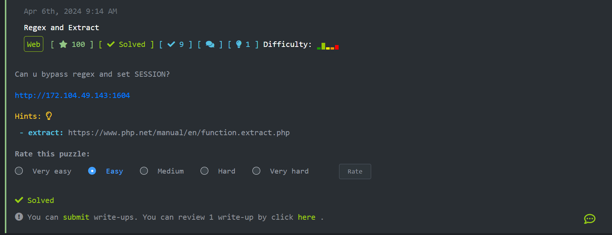
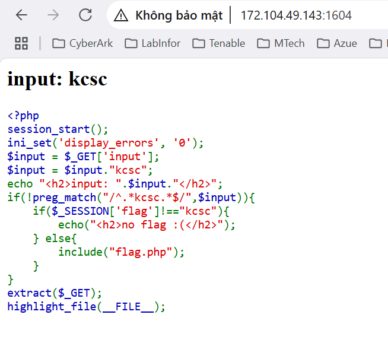
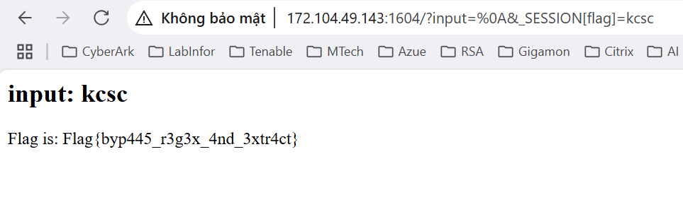

# CTF Write-Up: Regex and Extract

## Mô tả bài thử thách  
Bài thử thách tại [viblo](https://ctf.viblo.asia/) với tên Challenge là Regex and Extract  

Đề bài như sau:  
  

Truy cập url của đề bài, chúng ta sẽ thấy mã nguồn php
  

### Phân tích mã PHP  
```php
<?php
session_start();
ini_set('display_errors', '0');
$input = $_GET['input'];
$input = $input."kcsc";
echo "<h2>input: ".$input."</h2>";
if(!preg_match("/^.*kcsc.*$/",$input)){
    if($_SESSION['flag']!=="kcsc"){
        echo("<h2>no flag :(</h2>");
    } else{
        include("flag.php");
    }
}
extract($_GET);
highlight_file(__FILE__);
```
Cùng phân tích nhanh đoạn code php trên để tìm hướng xử lý tìm flag nào!  
Chúng ta có thể thấy ở đoạn code  
```php
$input = $_GET['input'];
$input = $input."kcsc";
```  
Giá trị ***input*** nhận vào từ URL sẽ được nối thêm chuỗi ***kcsc***  
Điều kiện quan trọng để hiển thị flag nằm ở đoạn code  

```php
if(!preg_match("/^.*kcsc.*$/",$input)){
    if($_SESSION['flag']!=="kcsc"){
        echo("<h2>no flag :(</h2>");
    } else{
        include("flag.php");
    }
}
```  
Nếu không match regex chứa chuỗi "kcsc", và ***$_SESSION['flag'] == "kcsc"***, ta sẽ thấy flag.
Nhưng ***$input*** luôn được nối "kcsc" vào cuối → Regex luôn match!  

#### Ý tưởng khai thác  

Làm cho ***$input*** chứa "kcsc" nhưng regex không match → bypass được điều kiện if 
Cùng phân tích đoạn kiểm tra regex này để tìm cách bypass nào  
`preg_match("/^.*kcsc.*$/",$input)`
Trong regex trên chúng ta thấy trước và sau kcsc đều có ký tự `.` (dot) . Đây là một meta đơn giản nó biểu diễn bất kỳ ký tự nào ngoài trừ ký tự `return \r` hoặc `newline \n` . Hehe đọc đến đây là có ý tưởng khai thác rồi. Bây giờ chỉ cần truyền tham số newline vào biến ***$input*** . Vì `.` (dot) không match được ký tự \n, nên phần đầu (^.*) sẽ match chuỗi rỗng (trước newline), sau đó đến kcsc, nó sẽ bị tách dòng, regex không nối liền được → fail.  
Ký tự newline trong url được mã hoá thành **%0A** Giả sử ta truyền vào `?input=%0A` thì server sẽ hiểu `$input = "\n" . "kcsc";`  
Regex `/^.*kcsc.*$/` sẽ không match do có newline ngắt giữa dòng.  
Thế là xong được điều kiện đầu tiên.  
Tiếp theo chúng ta cần đảm bảo ***$_SESSION['flag'] == "kcsc"*** mà xem trên code đâu thấy chổ nào có biến _SESSION đâu :v . Ngó xuống cuối thấy có đoạn này `extract($_GET);` Nó sẽ tạo ra các biến PHP từ các tham số trong URL (query string). Ví dụ truyền vào URL như sau: `?input=test&_SESSION[flag]=kcsc` thì server sẽ xử lý 
```php 
$input = "test";
$_SESSION['flag'] = "kcsc";
```
Kết hợp 2 điều kiện trên thì payload hoàn chỉnh của chúng ta sẽ là `?input=%0A&_SESSION[flag]=kcsc`
Truy cập vào url của đề bài và truyền payload vào thôi 
 